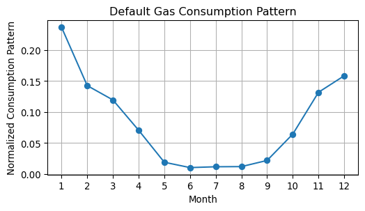
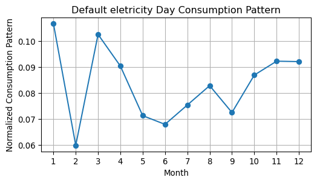
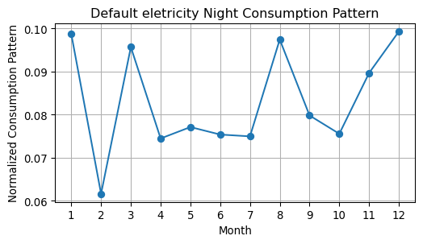

# November Energy Report


``` python
from Helper import generate_default_consumption_pattern_gas, generate_default_consumption_pattern_electricity_day, generate_default_consumption_pattern_electricity_night, plot_default_consumption_pattern
```

## Calculate yearly energy consumption

### VREG API

### Energy consumption pattern - extrapolated

In case no full history of the energy consumption is available, data
will be extrapolated based on the below pattern. This is the actual
consumption of a house in Belgium.

``` python
plot_default_consumption_pattern(generate_default_consumption_pattern_gas())
plot_default_consumption_pattern(generate_default_consumption_pattern_electricity_day())
plot_default_consumption_pattern(generate_default_consumption_pattern_electricity_night())
```







### Energy consumption pattern - actuals

### Result
