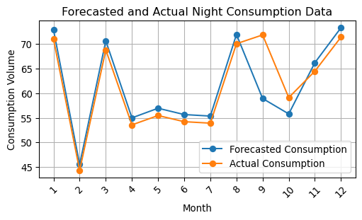

# November Energy Report


``` python
import pandas as pd
from great_tables import GT, md
from EnergyConsumption import EnergyConsumption
```

## Calculate yearly energy consumption

``` python
energy_consumption = EnergyConsumption()
```

### VREG API

Based on the default inputs, the VREG estimates a yearly consumption as
indicated below.

``` python
df_VREG = pd.DataFrame(data = {
  'Day': [energy_consumption.default_VREG['Day']],
  'Night': [energy_consumption.default_VREG['Night']],
  'Gas': [energy_consumption.default_VREG['Gas']]})

(
    GT(df_VREG)
    .tab_header(
        title=md("Estimated yearly consumption based on VREG"),
        subtitle=md("*In kWh*"),
    )
    .cols_label(
        Day="Electricity Day",
        Night="Electricity Night",
        Gas="Gas",
    )
    .cols_align("center")
    .fmt_integer(sep_mark='.')
)
```

<div id="cgfzejvxva" style="padding-left:0px;padding-right:0px;padding-top:10px;padding-bottom:10px;overflow-x:auto;overflow-y:auto;width:auto;height:auto;">
<style>
#cgfzejvxva table {
          font-family: -apple-system, BlinkMacSystemFont, 'Segoe UI', Roboto, Oxygen, Ubuntu, Cantarell, 'Helvetica Neue', 'Fira Sans', 'Droid Sans', Arial, sans-serif;
          -webkit-font-smoothing: antialiased;
          -moz-osx-font-smoothing: grayscale;
        }
&#10;#cgfzejvxva thead, tbody, tfoot, tr, td, th { border-style: none; }
 tr { background-color: transparent; }
#cgfzejvxva p { margin: 0; padding: 0; }
 #cgfzejvxva .gt_table { display: table; border-collapse: collapse; line-height: normal; margin-left: auto; margin-right: auto; color: #333333; font-size: 16px; font-weight: normal; font-style: normal; background-color: #FFFFFF; width: auto; border-top-style: solid; border-top-width: 2px; border-top-color: #A8A8A8; border-right-style: none; border-right-width: 2px; border-right-color: #D3D3D3; border-bottom-style: solid; border-bottom-width: 2px; border-bottom-color: #A8A8A8; border-left-style: none; border-left-width: 2px; border-left-color: #D3D3D3; }
 #cgfzejvxva .gt_caption { padding-top: 4px; padding-bottom: 4px; }
 #cgfzejvxva .gt_title { color: #333333; font-size: 125%; font-weight: initial; padding-top: 4px; padding-bottom: 4px; padding-left: 5px; padding-right: 5px; border-bottom-color: #FFFFFF; border-bottom-width: 0; }
 #cgfzejvxva .gt_subtitle { color: #333333; font-size: 85%; font-weight: initial; padding-top: 3px; padding-bottom: 5px; padding-left: 5px; padding-right: 5px; border-top-color: #FFFFFF; border-top-width: 0; }
 #cgfzejvxva .gt_heading { background-color: #FFFFFF; text-align: center; border-bottom-color: #FFFFFF; border-left-style: none; border-left-width: 1px; border-left-color: #D3D3D3; border-right-style: none; border-right-width: 1px; border-right-color: #D3D3D3; }
 #cgfzejvxva .gt_bottom_border { border-bottom-style: solid; border-bottom-width: 2px; border-bottom-color: #D3D3D3; }
 #cgfzejvxva .gt_col_headings { border-top-style: solid; border-top-width: 2px; border-top-color: #D3D3D3; border-bottom-style: solid; border-bottom-width: 2px; border-bottom-color: #D3D3D3; border-left-style: none; border-left-width: 1px; border-left-color: #D3D3D3; border-right-style: none; border-right-width: 1px; border-right-color: #D3D3D3; }
 #cgfzejvxva .gt_col_heading { color: #333333; background-color: #FFFFFF; font-size: 100%; font-weight: normal; text-transform: inherit; border-left-style: none; border-left-width: 1px; border-left-color: #D3D3D3; border-right-style: none; border-right-width: 1px; border-right-color: #D3D3D3; vertical-align: bottom; padding-top: 5px; padding-bottom: 5px; padding-left: 5px; padding-right: 5px; overflow-x: hidden; }
 #cgfzejvxva .gt_column_spanner_outer { color: #333333; background-color: #FFFFFF; font-size: 100%; font-weight: normal; text-transform: inherit; padding-top: 0; padding-bottom: 0; padding-left: 4px; padding-right: 4px; }
 #cgfzejvxva .gt_column_spanner_outer:first-child { padding-left: 0; }
 #cgfzejvxva .gt_column_spanner_outer:last-child { padding-right: 0; }
 #cgfzejvxva .gt_column_spanner { border-bottom-style: solid; border-bottom-width: 2px; border-bottom-color: #D3D3D3; vertical-align: bottom; padding-top: 5px; padding-bottom: 5px; overflow-x: hidden; display: inline-block; width: 100%; }
 #cgfzejvxva .gt_spanner_row { border-bottom-style: hidden; }
 #cgfzejvxva .gt_group_heading { padding-top: 8px; padding-bottom: 8px; padding-left: 5px; padding-right: 5px; color: #333333; background-color: #FFFFFF; font-size: 100%; font-weight: initial; text-transform: inherit; border-top-style: solid; border-top-width: 2px; border-top-color: #D3D3D3; border-bottom-style: solid; border-bottom-width: 2px; border-bottom-color: #D3D3D3; border-left-style: none; border-left-width: 1px; border-left-color: #D3D3D3; border-right-style: none; border-right-width: 1px; border-right-color: #D3D3D3; vertical-align: middle; text-align: left; }
 #cgfzejvxva .gt_empty_group_heading { padding: 0.5px; color: #333333; background-color: #FFFFFF; font-size: 100%; font-weight: initial; border-top-style: solid; border-top-width: 2px; border-top-color: #D3D3D3; border-bottom-style: solid; border-bottom-width: 2px; border-bottom-color: #D3D3D3; vertical-align: middle; }
 #cgfzejvxva .gt_from_md> :first-child { margin-top: 0; }
 #cgfzejvxva .gt_from_md> :last-child { margin-bottom: 0; }
 #cgfzejvxva .gt_row { padding-top: 8px; padding-bottom: 8px; padding-left: 5px; padding-right: 5px; margin: 10px; border-top-style: solid; border-top-width: 1px; border-top-color: #D3D3D3; border-left-style: none; border-left-width: 1px; border-left-color: #D3D3D3; border-right-style: none; border-right-width: 1px; border-right-color: #D3D3D3; vertical-align: middle; overflow-x: hidden; }
 #cgfzejvxva .gt_stub { color: #333333; background-color: #FFFFFF; font-size: 100%; font-weight: initial; text-transform: inherit; border-right-style: solid; border-right-width: 2px; border-right-color: #D3D3D3; padding-left: 5px; padding-right: 5px; }
 #cgfzejvxva .gt_stub_row_group { color: #333333; background-color: #FFFFFF; font-size: 100%; font-weight: initial; text-transform: inherit; border-right-style: solid; border-right-width: 2px; border-right-color: #D3D3D3; padding-left: 5px; padding-right: 5px; vertical-align: top; }
 #cgfzejvxva .gt_row_group_first td { border-top-width: 2px; }
 #cgfzejvxva .gt_row_group_first th { border-top-width: 2px; }
 #cgfzejvxva .gt_striped { background-color: rgba(128,128,128,0.05); }
 #cgfzejvxva .gt_table_body { border-top-style: solid; border-top-width: 2px; border-top-color: #D3D3D3; border-bottom-style: solid; border-bottom-width: 2px; border-bottom-color: #D3D3D3; }
 #cgfzejvxva .gt_sourcenotes { color: #333333; background-color: #FFFFFF; border-bottom-style: none; border-bottom-width: 2px; border-bottom-color: #D3D3D3; border-left-style: none; border-left-width: 2px; border-left-color: #D3D3D3; border-right-style: none; border-right-width: 2px; border-right-color: #D3D3D3; }
 #cgfzejvxva .gt_sourcenote { font-size: 90%; padding-top: 4px; padding-bottom: 4px; padding-left: 5px; padding-right: 5px; text-align: left; }
 #cgfzejvxva .gt_left { text-align: left; }
 #cgfzejvxva .gt_center { text-align: center; }
 #cgfzejvxva .gt_right { text-align: right; font-variant-numeric: tabular-nums; }
 #cgfzejvxva .gt_font_normal { font-weight: normal; }
 #cgfzejvxva .gt_font_bold { font-weight: bold; }
 #cgfzejvxva .gt_font_italic { font-style: italic; }
 #cgfzejvxva .gt_super { font-size: 65%; }
 #cgfzejvxva .gt_footnote_marks { font-size: 75%; vertical-align: 0.4em; position: initial; }
 #cgfzejvxva .gt_asterisk { font-size: 100%; vertical-align: 0; }
 &#10;</style>

| Estimated yearly consumption based on VREG |                   |        |
|--------------------------------------------|-------------------|--------|
| *In kWh*                                   |                   |        |
| Electricity Day                            | Electricity Night | Gas    |
| 1.195                                      | 1.674             | 14.715 |

&#10;</div>
        &#10;
### Energy consumption pattern - extrapolated

In case no full history of the energy consumption is available, data
will be extrapolated based on the below pattern. This is the actual
consumption of a house in Belgium.

``` python
energy_consumption.plot_default_consumption_pattern('Gas')
energy_consumption.plot_default_consumption_pattern('Day')
energy_consumption.plot_default_consumption_pattern('Night')
```


Applying the pattern to the last 12 months, we can calculate the yearly
consumption.

``` python
energy_consumption.plot_forecasted_consumption_data('Gas')
energy_consumption.plot_forecasted_consumption_data('Day')
energy_consumption.plot_forecasted_consumption_data('Night')
```




``` python
# Calculate yearly consumption based on forecasted data
forecasted_yearly_consumption = energy_consumption.get_forecasted_consumption_last_12_months()

df_consumption = pd.DataFrame(data = {
  'Day': [forecasted_yearly_consumption['Day']],
  'Night': [forecasted_yearly_consumption['Night']],
  'Gas': [forecasted_yearly_consumption['Gas']]})

(
    GT(df_consumption)
    .tab_header(
        title=md("Forecasted yearly consumption based on user input"),
        subtitle=md("*In kWh*"),
    )
    .cols_label(
        Day="Electricity Day",
        Night="Electricity Night",
        Gas="Gas",
    )
    .cols_align("center")
    .fmt_integer(sep_mark='.')
)
```

<div id="htmiaamgvx" style="padding-left:0px;padding-right:0px;padding-top:10px;padding-bottom:10px;overflow-x:auto;overflow-y:auto;width:auto;height:auto;">
<style>
#htmiaamgvx table {
          font-family: -apple-system, BlinkMacSystemFont, 'Segoe UI', Roboto, Oxygen, Ubuntu, Cantarell, 'Helvetica Neue', 'Fira Sans', 'Droid Sans', Arial, sans-serif;
          -webkit-font-smoothing: antialiased;
          -moz-osx-font-smoothing: grayscale;
        }
&#10;#htmiaamgvx thead, tbody, tfoot, tr, td, th { border-style: none; }
 tr { background-color: transparent; }
#htmiaamgvx p { margin: 0; padding: 0; }
 #htmiaamgvx .gt_table { display: table; border-collapse: collapse; line-height: normal; margin-left: auto; margin-right: auto; color: #333333; font-size: 16px; font-weight: normal; font-style: normal; background-color: #FFFFFF; width: auto; border-top-style: solid; border-top-width: 2px; border-top-color: #A8A8A8; border-right-style: none; border-right-width: 2px; border-right-color: #D3D3D3; border-bottom-style: solid; border-bottom-width: 2px; border-bottom-color: #A8A8A8; border-left-style: none; border-left-width: 2px; border-left-color: #D3D3D3; }
 #htmiaamgvx .gt_caption { padding-top: 4px; padding-bottom: 4px; }
 #htmiaamgvx .gt_title { color: #333333; font-size: 125%; font-weight: initial; padding-top: 4px; padding-bottom: 4px; padding-left: 5px; padding-right: 5px; border-bottom-color: #FFFFFF; border-bottom-width: 0; }
 #htmiaamgvx .gt_subtitle { color: #333333; font-size: 85%; font-weight: initial; padding-top: 3px; padding-bottom: 5px; padding-left: 5px; padding-right: 5px; border-top-color: #FFFFFF; border-top-width: 0; }
 #htmiaamgvx .gt_heading { background-color: #FFFFFF; text-align: center; border-bottom-color: #FFFFFF; border-left-style: none; border-left-width: 1px; border-left-color: #D3D3D3; border-right-style: none; border-right-width: 1px; border-right-color: #D3D3D3; }
 #htmiaamgvx .gt_bottom_border { border-bottom-style: solid; border-bottom-width: 2px; border-bottom-color: #D3D3D3; }
 #htmiaamgvx .gt_col_headings { border-top-style: solid; border-top-width: 2px; border-top-color: #D3D3D3; border-bottom-style: solid; border-bottom-width: 2px; border-bottom-color: #D3D3D3; border-left-style: none; border-left-width: 1px; border-left-color: #D3D3D3; border-right-style: none; border-right-width: 1px; border-right-color: #D3D3D3; }
 #htmiaamgvx .gt_col_heading { color: #333333; background-color: #FFFFFF; font-size: 100%; font-weight: normal; text-transform: inherit; border-left-style: none; border-left-width: 1px; border-left-color: #D3D3D3; border-right-style: none; border-right-width: 1px; border-right-color: #D3D3D3; vertical-align: bottom; padding-top: 5px; padding-bottom: 5px; padding-left: 5px; padding-right: 5px; overflow-x: hidden; }
 #htmiaamgvx .gt_column_spanner_outer { color: #333333; background-color: #FFFFFF; font-size: 100%; font-weight: normal; text-transform: inherit; padding-top: 0; padding-bottom: 0; padding-left: 4px; padding-right: 4px; }
 #htmiaamgvx .gt_column_spanner_outer:first-child { padding-left: 0; }
 #htmiaamgvx .gt_column_spanner_outer:last-child { padding-right: 0; }
 #htmiaamgvx .gt_column_spanner { border-bottom-style: solid; border-bottom-width: 2px; border-bottom-color: #D3D3D3; vertical-align: bottom; padding-top: 5px; padding-bottom: 5px; overflow-x: hidden; display: inline-block; width: 100%; }
 #htmiaamgvx .gt_spanner_row { border-bottom-style: hidden; }
 #htmiaamgvx .gt_group_heading { padding-top: 8px; padding-bottom: 8px; padding-left: 5px; padding-right: 5px; color: #333333; background-color: #FFFFFF; font-size: 100%; font-weight: initial; text-transform: inherit; border-top-style: solid; border-top-width: 2px; border-top-color: #D3D3D3; border-bottom-style: solid; border-bottom-width: 2px; border-bottom-color: #D3D3D3; border-left-style: none; border-left-width: 1px; border-left-color: #D3D3D3; border-right-style: none; border-right-width: 1px; border-right-color: #D3D3D3; vertical-align: middle; text-align: left; }
 #htmiaamgvx .gt_empty_group_heading { padding: 0.5px; color: #333333; background-color: #FFFFFF; font-size: 100%; font-weight: initial; border-top-style: solid; border-top-width: 2px; border-top-color: #D3D3D3; border-bottom-style: solid; border-bottom-width: 2px; border-bottom-color: #D3D3D3; vertical-align: middle; }
 #htmiaamgvx .gt_from_md> :first-child { margin-top: 0; }
 #htmiaamgvx .gt_from_md> :last-child { margin-bottom: 0; }
 #htmiaamgvx .gt_row { padding-top: 8px; padding-bottom: 8px; padding-left: 5px; padding-right: 5px; margin: 10px; border-top-style: solid; border-top-width: 1px; border-top-color: #D3D3D3; border-left-style: none; border-left-width: 1px; border-left-color: #D3D3D3; border-right-style: none; border-right-width: 1px; border-right-color: #D3D3D3; vertical-align: middle; overflow-x: hidden; }
 #htmiaamgvx .gt_stub { color: #333333; background-color: #FFFFFF; font-size: 100%; font-weight: initial; text-transform: inherit; border-right-style: solid; border-right-width: 2px; border-right-color: #D3D3D3; padding-left: 5px; padding-right: 5px; }
 #htmiaamgvx .gt_stub_row_group { color: #333333; background-color: #FFFFFF; font-size: 100%; font-weight: initial; text-transform: inherit; border-right-style: solid; border-right-width: 2px; border-right-color: #D3D3D3; padding-left: 5px; padding-right: 5px; vertical-align: top; }
 #htmiaamgvx .gt_row_group_first td { border-top-width: 2px; }
 #htmiaamgvx .gt_row_group_first th { border-top-width: 2px; }
 #htmiaamgvx .gt_striped { background-color: rgba(128,128,128,0.05); }
 #htmiaamgvx .gt_table_body { border-top-style: solid; border-top-width: 2px; border-top-color: #D3D3D3; border-bottom-style: solid; border-bottom-width: 2px; border-bottom-color: #D3D3D3; }
 #htmiaamgvx .gt_sourcenotes { color: #333333; background-color: #FFFFFF; border-bottom-style: none; border-bottom-width: 2px; border-bottom-color: #D3D3D3; border-left-style: none; border-left-width: 2px; border-left-color: #D3D3D3; border-right-style: none; border-right-width: 2px; border-right-color: #D3D3D3; }
 #htmiaamgvx .gt_sourcenote { font-size: 90%; padding-top: 4px; padding-bottom: 4px; padding-left: 5px; padding-right: 5px; text-align: left; }
 #htmiaamgvx .gt_left { text-align: left; }
 #htmiaamgvx .gt_center { text-align: center; }
 #htmiaamgvx .gt_right { text-align: right; font-variant-numeric: tabular-nums; }
 #htmiaamgvx .gt_font_normal { font-weight: normal; }
 #htmiaamgvx .gt_font_bold { font-weight: bold; }
 #htmiaamgvx .gt_font_italic { font-style: italic; }
 #htmiaamgvx .gt_super { font-size: 65%; }
 #htmiaamgvx .gt_footnote_marks { font-size: 75%; vertical-align: 0.4em; position: initial; }
 #htmiaamgvx .gt_asterisk { font-size: 100%; vertical-align: 0; }
 &#10;</style>

| Forecasted yearly consumption based on user input |                   |       |
|---------------------------------------------------|-------------------|-------|
| *In kWh*                                          |                   |       |
| Electricity Day                                   | Electricity Night | Gas   |
| 1.035                                             | 738               | 8.037 |

&#10;</div>
        &#10;
### Energy consumption pattern - actuals

The following energy consumption was inputted by the user.

``` python
energy_consumption.plot_actual_consumption_data('Gas')
energy_consumption.plot_actual_consumption_data('Day')
energy_consumption.plot_actual_consumption_data('Night')
```


Extracting the data from the last 12 months, we can calculate the yearly
consumption.

``` python
# Calculate yearly consumption based on actuals
yearly_consumption = energy_consumption.get_actual_consumption_last_12_months()

df_consumption = pd.DataFrame(data = {
  'Day': [yearly_consumption['Day']],
  'Night': [yearly_consumption['Night']],
  'Gas': [yearly_consumption['Gas']]})

(
    GT(df_consumption)
    .tab_header(
        title=md("Actual yearly consumption based on user input"),
        subtitle=md("*In kWh*"),
    )
    .cols_label(
        Day="Electricity Day",
        Night="Electricity Night",
        Gas="Gas",
    )
    .cols_align("center")
    .fmt_integer(sep_mark='.')
)
```

<div id="rcfnoqfdpm" style="padding-left:0px;padding-right:0px;padding-top:10px;padding-bottom:10px;overflow-x:auto;overflow-y:auto;width:auto;height:auto;">
<style>
#rcfnoqfdpm table {
          font-family: -apple-system, BlinkMacSystemFont, 'Segoe UI', Roboto, Oxygen, Ubuntu, Cantarell, 'Helvetica Neue', 'Fira Sans', 'Droid Sans', Arial, sans-serif;
          -webkit-font-smoothing: antialiased;
          -moz-osx-font-smoothing: grayscale;
        }
&#10;#rcfnoqfdpm thead, tbody, tfoot, tr, td, th { border-style: none; }
 tr { background-color: transparent; }
#rcfnoqfdpm p { margin: 0; padding: 0; }
 #rcfnoqfdpm .gt_table { display: table; border-collapse: collapse; line-height: normal; margin-left: auto; margin-right: auto; color: #333333; font-size: 16px; font-weight: normal; font-style: normal; background-color: #FFFFFF; width: auto; border-top-style: solid; border-top-width: 2px; border-top-color: #A8A8A8; border-right-style: none; border-right-width: 2px; border-right-color: #D3D3D3; border-bottom-style: solid; border-bottom-width: 2px; border-bottom-color: #A8A8A8; border-left-style: none; border-left-width: 2px; border-left-color: #D3D3D3; }
 #rcfnoqfdpm .gt_caption { padding-top: 4px; padding-bottom: 4px; }
 #rcfnoqfdpm .gt_title { color: #333333; font-size: 125%; font-weight: initial; padding-top: 4px; padding-bottom: 4px; padding-left: 5px; padding-right: 5px; border-bottom-color: #FFFFFF; border-bottom-width: 0; }
 #rcfnoqfdpm .gt_subtitle { color: #333333; font-size: 85%; font-weight: initial; padding-top: 3px; padding-bottom: 5px; padding-left: 5px; padding-right: 5px; border-top-color: #FFFFFF; border-top-width: 0; }
 #rcfnoqfdpm .gt_heading { background-color: #FFFFFF; text-align: center; border-bottom-color: #FFFFFF; border-left-style: none; border-left-width: 1px; border-left-color: #D3D3D3; border-right-style: none; border-right-width: 1px; border-right-color: #D3D3D3; }
 #rcfnoqfdpm .gt_bottom_border { border-bottom-style: solid; border-bottom-width: 2px; border-bottom-color: #D3D3D3; }
 #rcfnoqfdpm .gt_col_headings { border-top-style: solid; border-top-width: 2px; border-top-color: #D3D3D3; border-bottom-style: solid; border-bottom-width: 2px; border-bottom-color: #D3D3D3; border-left-style: none; border-left-width: 1px; border-left-color: #D3D3D3; border-right-style: none; border-right-width: 1px; border-right-color: #D3D3D3; }
 #rcfnoqfdpm .gt_col_heading { color: #333333; background-color: #FFFFFF; font-size: 100%; font-weight: normal; text-transform: inherit; border-left-style: none; border-left-width: 1px; border-left-color: #D3D3D3; border-right-style: none; border-right-width: 1px; border-right-color: #D3D3D3; vertical-align: bottom; padding-top: 5px; padding-bottom: 5px; padding-left: 5px; padding-right: 5px; overflow-x: hidden; }
 #rcfnoqfdpm .gt_column_spanner_outer { color: #333333; background-color: #FFFFFF; font-size: 100%; font-weight: normal; text-transform: inherit; padding-top: 0; padding-bottom: 0; padding-left: 4px; padding-right: 4px; }
 #rcfnoqfdpm .gt_column_spanner_outer:first-child { padding-left: 0; }
 #rcfnoqfdpm .gt_column_spanner_outer:last-child { padding-right: 0; }
 #rcfnoqfdpm .gt_column_spanner { border-bottom-style: solid; border-bottom-width: 2px; border-bottom-color: #D3D3D3; vertical-align: bottom; padding-top: 5px; padding-bottom: 5px; overflow-x: hidden; display: inline-block; width: 100%; }
 #rcfnoqfdpm .gt_spanner_row { border-bottom-style: hidden; }
 #rcfnoqfdpm .gt_group_heading { padding-top: 8px; padding-bottom: 8px; padding-left: 5px; padding-right: 5px; color: #333333; background-color: #FFFFFF; font-size: 100%; font-weight: initial; text-transform: inherit; border-top-style: solid; border-top-width: 2px; border-top-color: #D3D3D3; border-bottom-style: solid; border-bottom-width: 2px; border-bottom-color: #D3D3D3; border-left-style: none; border-left-width: 1px; border-left-color: #D3D3D3; border-right-style: none; border-right-width: 1px; border-right-color: #D3D3D3; vertical-align: middle; text-align: left; }
 #rcfnoqfdpm .gt_empty_group_heading { padding: 0.5px; color: #333333; background-color: #FFFFFF; font-size: 100%; font-weight: initial; border-top-style: solid; border-top-width: 2px; border-top-color: #D3D3D3; border-bottom-style: solid; border-bottom-width: 2px; border-bottom-color: #D3D3D3; vertical-align: middle; }
 #rcfnoqfdpm .gt_from_md> :first-child { margin-top: 0; }
 #rcfnoqfdpm .gt_from_md> :last-child { margin-bottom: 0; }
 #rcfnoqfdpm .gt_row { padding-top: 8px; padding-bottom: 8px; padding-left: 5px; padding-right: 5px; margin: 10px; border-top-style: solid; border-top-width: 1px; border-top-color: #D3D3D3; border-left-style: none; border-left-width: 1px; border-left-color: #D3D3D3; border-right-style: none; border-right-width: 1px; border-right-color: #D3D3D3; vertical-align: middle; overflow-x: hidden; }
 #rcfnoqfdpm .gt_stub { color: #333333; background-color: #FFFFFF; font-size: 100%; font-weight: initial; text-transform: inherit; border-right-style: solid; border-right-width: 2px; border-right-color: #D3D3D3; padding-left: 5px; padding-right: 5px; }
 #rcfnoqfdpm .gt_stub_row_group { color: #333333; background-color: #FFFFFF; font-size: 100%; font-weight: initial; text-transform: inherit; border-right-style: solid; border-right-width: 2px; border-right-color: #D3D3D3; padding-left: 5px; padding-right: 5px; vertical-align: top; }
 #rcfnoqfdpm .gt_row_group_first td { border-top-width: 2px; }
 #rcfnoqfdpm .gt_row_group_first th { border-top-width: 2px; }
 #rcfnoqfdpm .gt_striped { background-color: rgba(128,128,128,0.05); }
 #rcfnoqfdpm .gt_table_body { border-top-style: solid; border-top-width: 2px; border-top-color: #D3D3D3; border-bottom-style: solid; border-bottom-width: 2px; border-bottom-color: #D3D3D3; }
 #rcfnoqfdpm .gt_sourcenotes { color: #333333; background-color: #FFFFFF; border-bottom-style: none; border-bottom-width: 2px; border-bottom-color: #D3D3D3; border-left-style: none; border-left-width: 2px; border-left-color: #D3D3D3; border-right-style: none; border-right-width: 2px; border-right-color: #D3D3D3; }
 #rcfnoqfdpm .gt_sourcenote { font-size: 90%; padding-top: 4px; padding-bottom: 4px; padding-left: 5px; padding-right: 5px; text-align: left; }
 #rcfnoqfdpm .gt_left { text-align: left; }
 #rcfnoqfdpm .gt_center { text-align: center; }
 #rcfnoqfdpm .gt_right { text-align: right; font-variant-numeric: tabular-nums; }
 #rcfnoqfdpm .gt_font_normal { font-weight: normal; }
 #rcfnoqfdpm .gt_font_bold { font-weight: bold; }
 #rcfnoqfdpm .gt_font_italic { font-style: italic; }
 #rcfnoqfdpm .gt_super { font-size: 65%; }
 #rcfnoqfdpm .gt_footnote_marks { font-size: 75%; vertical-align: 0.4em; position: initial; }
 #rcfnoqfdpm .gt_asterisk { font-size: 100%; vertical-align: 0; }
 &#10;</style>

| Actual yearly consumption based on user input |                   |       |
|-----------------------------------------------|-------------------|-------|
| *In kWh*                                      |                   |       |
| Electricity Day                               | Electricity Night | Gas   |
| 1.035                                         | 738               | 8.037 |

&#10;</div>
        &#10;
### Result

``` python
# Calculation method
method = energy_consumption.get_consumption_data_calculation()
print('Calculation method:')
print(method)

consumption = energy_consumption.get_total_consumption_data()

df_consumption = pd.DataFrame(data = {
  'Day': [yearly_consumption['Day']],
  'Night': [yearly_consumption['Night']],
  'Gas': [yearly_consumption['Gas']]})

(
    GT(df_consumption)
    .tab_header(
        title=md("Yearky consumption based on " + method),
        subtitle=md("*In kWh*"),
    )
    .cols_label(
        Day="Electricity Day",
        Night="Electricity Night",
        Gas="Gas",
    )
    .cols_align("center")
    .fmt_integer(sep_mark='.')
)
```

    Calculation method:
    actual

<div id="hzlwexrmcs" style="padding-left:0px;padding-right:0px;padding-top:10px;padding-bottom:10px;overflow-x:auto;overflow-y:auto;width:auto;height:auto;">
<style>
#hzlwexrmcs table {
          font-family: -apple-system, BlinkMacSystemFont, 'Segoe UI', Roboto, Oxygen, Ubuntu, Cantarell, 'Helvetica Neue', 'Fira Sans', 'Droid Sans', Arial, sans-serif;
          -webkit-font-smoothing: antialiased;
          -moz-osx-font-smoothing: grayscale;
        }
&#10;#hzlwexrmcs thead, tbody, tfoot, tr, td, th { border-style: none; }
 tr { background-color: transparent; }
#hzlwexrmcs p { margin: 0; padding: 0; }
 #hzlwexrmcs .gt_table { display: table; border-collapse: collapse; line-height: normal; margin-left: auto; margin-right: auto; color: #333333; font-size: 16px; font-weight: normal; font-style: normal; background-color: #FFFFFF; width: auto; border-top-style: solid; border-top-width: 2px; border-top-color: #A8A8A8; border-right-style: none; border-right-width: 2px; border-right-color: #D3D3D3; border-bottom-style: solid; border-bottom-width: 2px; border-bottom-color: #A8A8A8; border-left-style: none; border-left-width: 2px; border-left-color: #D3D3D3; }
 #hzlwexrmcs .gt_caption { padding-top: 4px; padding-bottom: 4px; }
 #hzlwexrmcs .gt_title { color: #333333; font-size: 125%; font-weight: initial; padding-top: 4px; padding-bottom: 4px; padding-left: 5px; padding-right: 5px; border-bottom-color: #FFFFFF; border-bottom-width: 0; }
 #hzlwexrmcs .gt_subtitle { color: #333333; font-size: 85%; font-weight: initial; padding-top: 3px; padding-bottom: 5px; padding-left: 5px; padding-right: 5px; border-top-color: #FFFFFF; border-top-width: 0; }
 #hzlwexrmcs .gt_heading { background-color: #FFFFFF; text-align: center; border-bottom-color: #FFFFFF; border-left-style: none; border-left-width: 1px; border-left-color: #D3D3D3; border-right-style: none; border-right-width: 1px; border-right-color: #D3D3D3; }
 #hzlwexrmcs .gt_bottom_border { border-bottom-style: solid; border-bottom-width: 2px; border-bottom-color: #D3D3D3; }
 #hzlwexrmcs .gt_col_headings { border-top-style: solid; border-top-width: 2px; border-top-color: #D3D3D3; border-bottom-style: solid; border-bottom-width: 2px; border-bottom-color: #D3D3D3; border-left-style: none; border-left-width: 1px; border-left-color: #D3D3D3; border-right-style: none; border-right-width: 1px; border-right-color: #D3D3D3; }
 #hzlwexrmcs .gt_col_heading { color: #333333; background-color: #FFFFFF; font-size: 100%; font-weight: normal; text-transform: inherit; border-left-style: none; border-left-width: 1px; border-left-color: #D3D3D3; border-right-style: none; border-right-width: 1px; border-right-color: #D3D3D3; vertical-align: bottom; padding-top: 5px; padding-bottom: 5px; padding-left: 5px; padding-right: 5px; overflow-x: hidden; }
 #hzlwexrmcs .gt_column_spanner_outer { color: #333333; background-color: #FFFFFF; font-size: 100%; font-weight: normal; text-transform: inherit; padding-top: 0; padding-bottom: 0; padding-left: 4px; padding-right: 4px; }
 #hzlwexrmcs .gt_column_spanner_outer:first-child { padding-left: 0; }
 #hzlwexrmcs .gt_column_spanner_outer:last-child { padding-right: 0; }
 #hzlwexrmcs .gt_column_spanner { border-bottom-style: solid; border-bottom-width: 2px; border-bottom-color: #D3D3D3; vertical-align: bottom; padding-top: 5px; padding-bottom: 5px; overflow-x: hidden; display: inline-block; width: 100%; }
 #hzlwexrmcs .gt_spanner_row { border-bottom-style: hidden; }
 #hzlwexrmcs .gt_group_heading { padding-top: 8px; padding-bottom: 8px; padding-left: 5px; padding-right: 5px; color: #333333; background-color: #FFFFFF; font-size: 100%; font-weight: initial; text-transform: inherit; border-top-style: solid; border-top-width: 2px; border-top-color: #D3D3D3; border-bottom-style: solid; border-bottom-width: 2px; border-bottom-color: #D3D3D3; border-left-style: none; border-left-width: 1px; border-left-color: #D3D3D3; border-right-style: none; border-right-width: 1px; border-right-color: #D3D3D3; vertical-align: middle; text-align: left; }
 #hzlwexrmcs .gt_empty_group_heading { padding: 0.5px; color: #333333; background-color: #FFFFFF; font-size: 100%; font-weight: initial; border-top-style: solid; border-top-width: 2px; border-top-color: #D3D3D3; border-bottom-style: solid; border-bottom-width: 2px; border-bottom-color: #D3D3D3; vertical-align: middle; }
 #hzlwexrmcs .gt_from_md> :first-child { margin-top: 0; }
 #hzlwexrmcs .gt_from_md> :last-child { margin-bottom: 0; }
 #hzlwexrmcs .gt_row { padding-top: 8px; padding-bottom: 8px; padding-left: 5px; padding-right: 5px; margin: 10px; border-top-style: solid; border-top-width: 1px; border-top-color: #D3D3D3; border-left-style: none; border-left-width: 1px; border-left-color: #D3D3D3; border-right-style: none; border-right-width: 1px; border-right-color: #D3D3D3; vertical-align: middle; overflow-x: hidden; }
 #hzlwexrmcs .gt_stub { color: #333333; background-color: #FFFFFF; font-size: 100%; font-weight: initial; text-transform: inherit; border-right-style: solid; border-right-width: 2px; border-right-color: #D3D3D3; padding-left: 5px; padding-right: 5px; }
 #hzlwexrmcs .gt_stub_row_group { color: #333333; background-color: #FFFFFF; font-size: 100%; font-weight: initial; text-transform: inherit; border-right-style: solid; border-right-width: 2px; border-right-color: #D3D3D3; padding-left: 5px; padding-right: 5px; vertical-align: top; }
 #hzlwexrmcs .gt_row_group_first td { border-top-width: 2px; }
 #hzlwexrmcs .gt_row_group_first th { border-top-width: 2px; }
 #hzlwexrmcs .gt_striped { background-color: rgba(128,128,128,0.05); }
 #hzlwexrmcs .gt_table_body { border-top-style: solid; border-top-width: 2px; border-top-color: #D3D3D3; border-bottom-style: solid; border-bottom-width: 2px; border-bottom-color: #D3D3D3; }
 #hzlwexrmcs .gt_sourcenotes { color: #333333; background-color: #FFFFFF; border-bottom-style: none; border-bottom-width: 2px; border-bottom-color: #D3D3D3; border-left-style: none; border-left-width: 2px; border-left-color: #D3D3D3; border-right-style: none; border-right-width: 2px; border-right-color: #D3D3D3; }
 #hzlwexrmcs .gt_sourcenote { font-size: 90%; padding-top: 4px; padding-bottom: 4px; padding-left: 5px; padding-right: 5px; text-align: left; }
 #hzlwexrmcs .gt_left { text-align: left; }
 #hzlwexrmcs .gt_center { text-align: center; }
 #hzlwexrmcs .gt_right { text-align: right; font-variant-numeric: tabular-nums; }
 #hzlwexrmcs .gt_font_normal { font-weight: normal; }
 #hzlwexrmcs .gt_font_bold { font-weight: bold; }
 #hzlwexrmcs .gt_font_italic { font-style: italic; }
 #hzlwexrmcs .gt_super { font-size: 65%; }
 #hzlwexrmcs .gt_footnote_marks { font-size: 75%; vertical-align: 0.4em; position: initial; }
 #hzlwexrmcs .gt_asterisk { font-size: 100%; vertical-align: 0; }
 &#10;</style>

| Yearky consumption based on actual |                   |       |
|------------------------------------|-------------------|-------|
| *In kWh*                           |                   |       |
| Electricity Day                    | Electricity Night | Gas   |
| 1.035                              | 738               | 8.037 |

&#10;</div>
        
